# Addressables Referencer Usage

This documentation assumes you already know how to set up addressable groups for your own assets and scenes.

Refer to the [Addressables Package Documentation](https://docs.unity3d.com/Packages/com.unity.addressables@3.1/manual/index.html) for instructions and details.

Table of contents
- [Requirements](#requirements)
- [Setup](#setup)
    - [Initial setup](#initial-setup)
    - [Reset Addressables Referencer Settings](#reset-addressables-referencer-settings)
- [Bundle Analysis](#bundle-analysis)
    - [Setup Streaming Assets Folder](#setup-streaming-assets-folder)
    - [Run Bundle Analysis](#run-bundles-analysis)
    - [Path Id Overrides](#path-id-overrides)
- [Addressables Build](#addressables-build)
    - [Build Options](#build-options)
        - [Use Base Game Builtins Asset Bundle](#use-base-game-builtins-asset-bundle)
        - [Copy The Catalog To The Shared Group Build Path](#copy-the-catalog-to-the-shared-group-build-path)
        - [Create a Catalog For Build Target](#create-catalog-for-build-target)
    - [Build Addressables with References](#build-the-addressables-bundles-with-references)
- [Limitations and Caveats](#limitations-and-caveats)
    - [Game Version not Matching](#game-version-not-matching)
    - [Modifying Base Game Assets](#modifying-base-game-assets)
    - [Shaders](#shaders)
    - [AssetRipper Quirks](#assetripper-export-quirks)

## Requirements

- Addressables >3.0

## Setup

The Addressables Referencer window is accessible at `Window > Asset Management > Addressables Referencer`

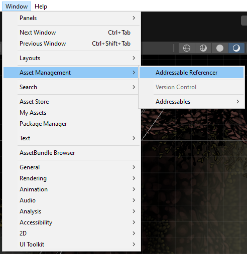

### Initial setup

Before Addressables Referencer can be used, the project requires an existing Addressables Asset Settings,

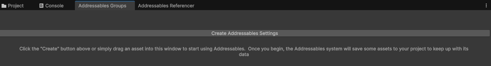

Should unity ask whether the "Legacy Bundles" should get converted to addressables, click on `Ignore` as this process will conflict with Addressables Referencer.

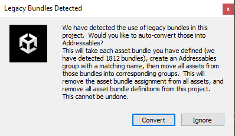

Afterward, Addressables Referencer settings will be automatically created and the Addressables Referencer window fully operational.

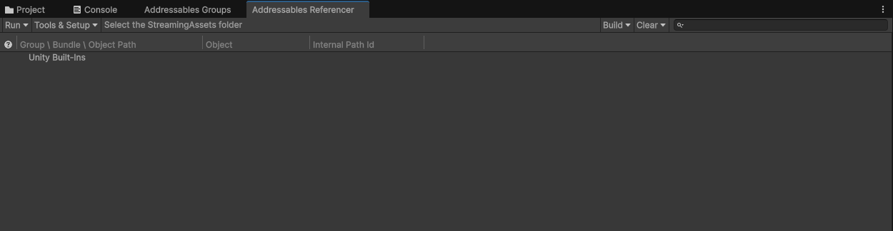

### Reset Addressables Referencer Settings

In case something went horribly wrong during your work, you can reset the Addressables Referencer settings to go back to a clean slate.

`Tools & Setup > Reset Addressables Referencer Settings`

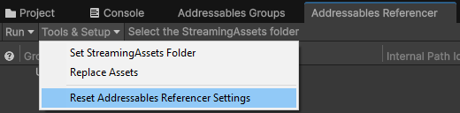

## Bundle Analysis

### Setup Streaming Assets Folder

The first step in setting up the bundles references is to point toward the StreamingAssets folder. It will open a browsing dialog window, use it to select the `StreamingAssets` or `StreamingAssets/aa` folder that contains the bundles you want to reference.

This can be either the actual game installation, or the `Assets/StreamingAssets[/aa]` folder within the Unity project if it contains it.

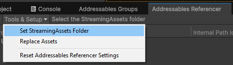

Once selected, the package will generate Addressable Groups that match the game's bundle structure. These groups are locked as "Read-Only" so that no asset can be manually assigned to them. 

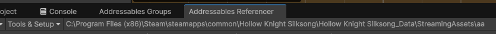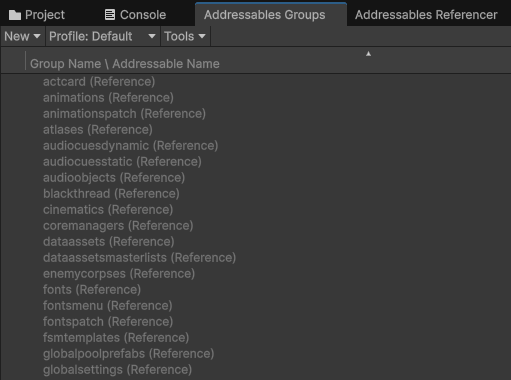

### Run Bundle Analysis

The groups are currently empty. To fill them with the base game addressables assets, use the `Run > Run Addressable Assets Analysis`

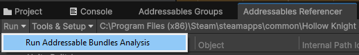

The process will go through every non-scene bundle referenced by the Addressable Catalog and may take a long time to finish. However this is a one-time action (hopefully).

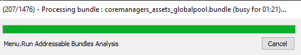

### Item Tree and Path Id Overrides

Once finished, the Addressables Referencer window will display the Reference group structure with all the bundles/assets that will be referenced during the build.

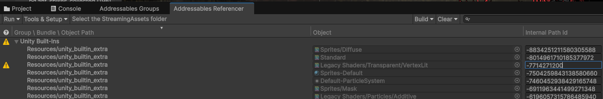

In case it is necessary, it is possible to apply overrides to the pathId that will be provided to the Build Pipeline. There shouldn't be much use cases for this in normal circumstances.

## Addressables Build

This package provides a customized build script to bundle assets with references. It brings several options to the build for ease of use.

### Build options

Addressables referencer build options are available on the right side of the Referencer toolbar.

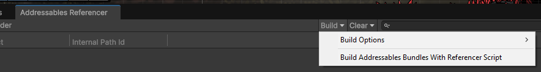

#### Use Base Game Builtins Asset Bundle

This option is used to tell the build pipeline whether it should create references to the base game's `<md4hash>_unitybuiltinassets.bundle` or not, usually you will want this to be `true` as it will make the referenced default shader work for every BuildTarget.
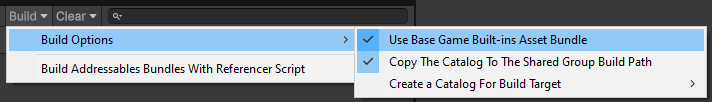

This option should be set to `false` if the scenes and assets you build into bundles need more builtin assets than what the base game provides.

#### Copy The Catalog To The Shared Group Build Path

This option defines whether the catalog generated by the Build Pipeline will get copied to the `Shared Bundle Settings` group's build path.
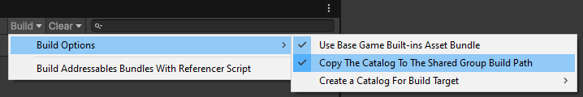
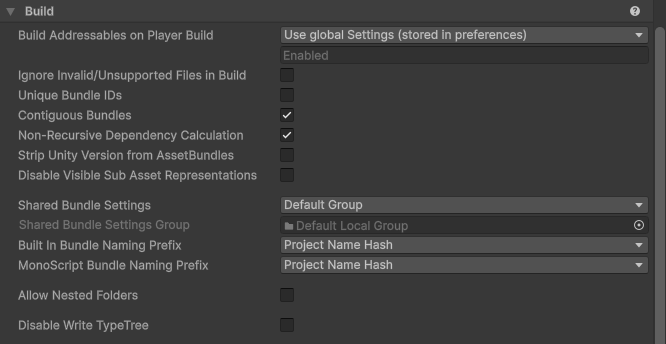

If enabled, you will find the files `catalog-[BuildTarget].bin` and `catalog-[BuildTarget].hash` at the Shared build path.

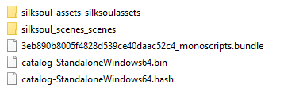

The currently active BuildProfile's `BuildTarget` is always included in the build process.

This option works in tandem with [Create a Catalog For Build Target](#create-a-catalog-for-build-target)

#### Create a Catalog For Build Target

This option defines a list of currently available `BuildTarget` for which a catalog will be processed and copied to the shared bundle build path as described just above.

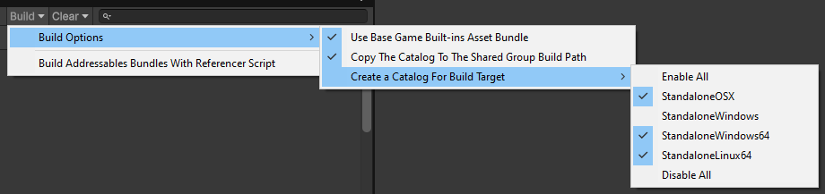
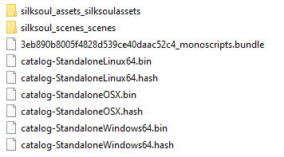

Once you have all your catalogs generated, its up to you to load the right one for the platform using [Addressables' interface](https://docs.unity3d.com/Packages/com.unity.addressables@3.1/api/UnityEngine.AddressableAssets.Addressables.LoadContentCatalogAsync.html)

NB: The `BuildTarget` is usually hardcoded in the Addressables paths and isn't easily reversed from the platform. A manual Switch/Case for it on `Application.Platform` is probably the easiest method.

### Build the Addressables Bundles with References

Once you find your options satisfying, there are two ways to build the addressables bundles with the referencer script:
- In the Addressables Groups Window
    - `ToolBar > Build > New Build > Reference Build Script`
- In the Addressables Referencer Window
    - `Toolbar > Build > Build Addressables Bundles With Referencer Script`

These two method produce the same output.

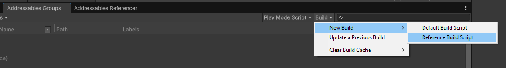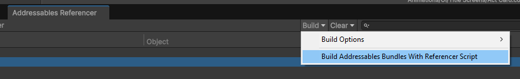

## Limitations and caveats

### Game version not matching

Addressables Referencer requires an exact match between the editor project and the game bundles assets for them to be referenced. If you try to reference assets from a newer version of the game you are modding compared to the version that is used in your editor project, you can run into trouble with certain assets that were edited by the developer between those versions. These assets (mainly GameObject prefabs) won't referenced and will be logged to avoid trouble at runtime.

Ensure the version you are working on is up to date with the current state of the game you are trying to mod.

### Modifying Base Game Assets

Using Addressables Referencer, you are required not to edit referenced assets and their dependencies, any modifications will either get ignored at runtime (because the asset you modified isn't shipped with your bundles) or will create issues for the objects you referenced the assets for because they won't be able to find the objects/components it needs. 

### Shaders

If you are shipping new shaders with your bundles, you will probably need to disable the `Create a Catalog For Build Target` option for anything other than the current active `BuildTarget` so that the shaders can be properly compiled for the target. In that case, you will need to do a separate Addressables build for every target your mod will support.

### AssetRipper export quirks

Sometimes with AssetRipper, you might encounter a case with Sprites where it creates both a .asset `Sprite` and a .png `Texture2D` for a single sprite. However, the `Texture2D` asset can hold the same `Sprite` as a sub-asset. In that case, the Sprite might appear incorrectly at runtime if the Addressable Asset is the .png `Texture2D` and its subasset `Sprite` when the actual asset being referenced is the .asset.

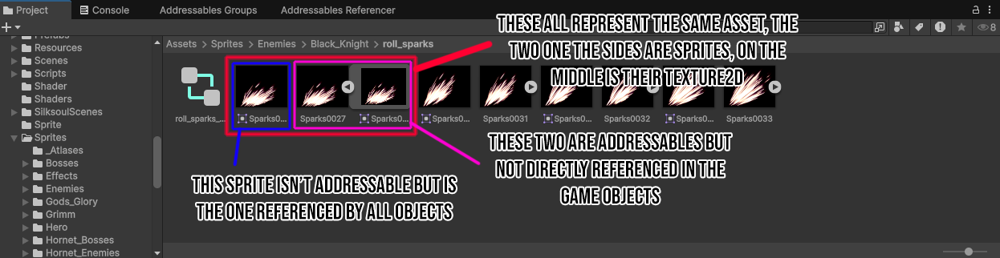

There are a few solutions to this:
- Make the .asset `Sprite` addressable as well in one of your own bundles.
- Replace the .asset `Sprite` references in the project by references to the `Texture2D` sub-asset version