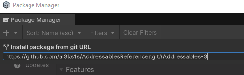

# Addressable Referencer

Addressables Referencer is an editor package providing a way to create bundles that reference a set of already existing addressable bundles.

The tool is primarily aimed at game modding to access directly the base game assets without repackaging and distributing them as part of your mod. 

## Why this project

This project was initialy started to allow Hollow Knight: Silksong mods with Asset Bundles created in Unity (Like custom scenes) to get a direct access to their in-game dependencies. As Silksong exclusively uses Addressables for managing assets .

This solves several issues at once:
- Mod size is drastically reduced: The bundles only ship the necessary data to function and the rest is directly fetched from the game. (See the 99% reduction below on a vanilla scene)
    - Faster loads
    - Less memory overhead
- Many assets in scenes make use of GameManager/SceneManager/AudioManager singletons, some of which couldn't be properly accessed when building scenes without references.
- Copyright issues, probably


## Features

- Analyze and reference a set of asset bundles for in-game use of "vanilla" assets from a Mod
- Support for multiple additional catalogs that can be exported to the Build Paths

## Installation

The easiest method to install is to use the package manager's "Install from Git url feature". 

The project is comprised of 3 Branches, only [Addressables-3](https://github.com/al3ks1s/AddressablesReferencer/tree/Addressables-3) and [Addressables-4](https://github.com/al3ks1s/AddressablesReferencer/tree/Addressables-4) contain a functionnal build script. The main branch only supports the analyzer and GUI.

This is due to Addressables V4 changing the internal version of the catalog, making the ones generated with Addressables 3 and lower incompatible with v4 and vice-versa.

#### Install specific branch
```
v3:
https://github.com/al3ks1s/AddressablesReferencer.git#Addressables-3
v4:
https://github.com/al3ks1s/AddressablesReferencer.git#Addressables-4

```


## Usage

See [Addressables Referencer Usage](./Documentation~/Addressables%20Referencer%20Usage.md)

##
This software is not sponsored by or affiliated with Unity Technologies or its affiliates. "Unity" is a registered trademark of Unity Technologies or its affiliates in the U.S. and elsewhere.